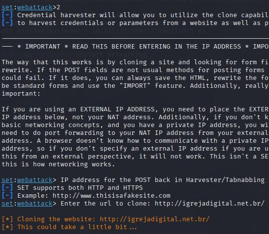

# Phishing para captura de credenciais

### Ferramentas
- Kali Linux
- Social Engineering Toolkit (SET)

### Configuração do Phishing
1. Acesso root:  
   ```sudo su```  
2. Iniciar setoolkit:  
   ```setoolkit```  
3. Opções selecionadas:  
   - Tipo de ataque: **Social-Engineering Attacks** (opção 1)  
   - Vetor de ataque: **Web Site Attack Vectors** (opção 2)  
   - Método de ataque: **Credential Harvester Attack Method** (opção 3)  
   - Método: **Site Cloner** (opção 2)
   - 
### Fluxo do Ataque
1. Clonagem do site
2. Serviço iniciado na porta 80  
3. Vítima insere credenciais no site clonado  
4. Captura de dados em tempo real:

   


